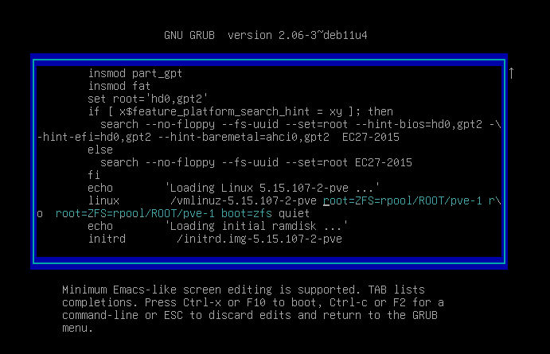

# PVE settings

- [PVE settings](#pve-settings)
	- [Encryption](#encryption)
		- [**Encrypting the `rpool/ROOT` dataset**](#encrypting-the-rpoolroot-dataset)
		- [**Encrypting the `rpool/data` dataset**](#encrypting-the-rpooldata-dataset)
		- [Create encrypted zpool of `NVME` disks](#create-encrypted-zpool-of-nvme-disks)
		- [**Unlock service**](#unlock-service)
			- [Fix possible pool disappearence after reboot (very optional)](#fix-possible-pool-disappearence-after-reboot-very-optional)
		- [**Creating usb key-unlock**](#creating-usb-key-unlock)
		- [**Automatic decrypt boot filesystem with USB key**](#automatic-decrypt-boot-filesystem-with-usb-key)
	- [**Disable cluster's services (in case of standalone)**](#disable-clusters-services-in-case-of-standalone)
	- [**Limit ZFS Memory Usage**](#limit-zfs-memory-usage)
	- [**GPU passthrough**](#gpu-passthrough)


## Encryption

### **Encrypting the `rpool/ROOT` dataset**

https://privsec.dev/posts/linux/using-native-zfs-encryption-with-proxmox/

First, boot into the initramfs. On the startup menu, press `e` to edit the boot argument. Remove `root=ZFS=rpool/ROOT/pve-1 boot=zfs` from the argument and press `enter`.


Load in the `zfs` kernel module:

```bash
modprobe zfs
```
Execute commands:

**Import the old**
```
zpool import -f rpool
```

**Make a snapshot of the current one**
```
zfs snapshot -r rpool/ROOT@copy
```

**Send the snapshot to a temporary root**

```
zfs send -R rpool/ROOT@copy | zfs receive rpool/copyroot
```

**Destroy the old unencrypted root**
```
zfs destroy -r rpool/ROOT
```
**Create a new zfs root, with encryption turned on
OR -o encryption=aes-256-gcm - aes-256-ccm vs aes-256-gcm, default is aes-256-gcm so we are good**
```
dd if=/dev/disk/by-label/encrypt-key bs=11 count=1 | zfs create -o encryption=on -o keyformat=passphrase rpool/ROOT
```

**Copy the files from the copy to the new encrypted zfs root**
```
zfs send -R rpool/copyroot/pve-1@copy | zfs receive -o encryption=on rpool/ROOT/pve-1
```
**Deviate from the original gist and delete copyroot**
```
zfs destroy -r rpool/copyroot
```

**Set the Mountpoint**
```
zfs set mountpoint=/ rpool/ROOT/pve-1
```
**Export the pool again, so you can boot from it**
```
zpool export rpool
```

**Reboot into the system. You should now be prompted for an encryption password.**
```
reboot -f
```

### **Encrypting the `rpool/data` dataset**

Now we can ssh to the system and execute commands:

**Destroy the original dataset**
```
zfs destroy -r rpool/data
```

**Create a new encryption key**
```
dd if=/dev/urandom bs=32 count=1 of=/.rpool_data.key
```

**Set the approprieate permission**
```
chmod 400 /.rpool_data.key
```

**Make the key immutable**
```
chattr +i /.rpool_data.key
```

**Create a new dataset with encryption enabled**
```
zfs create -o encryption=on -o keylocation=file:///.rpool_data.key -o keyformat=raw rpool/data
```

### Create encrypted zpool of `NVME` disks

Execute commands:

**Create a new encryption key**
```
dd if=/dev/urandom bs=32 count=1 of=/.nvme_data.key
```

**Set the approprieate permission**
```
chmod 400 /.nvme_data.key
```

**Make the key immutable**
```
chattr +i /.nvme_data.key
```

**Create zpool**
```
zpool create -o feature@encryption=enabled -o ashift=12 -O compression=lz4 -O relatime=on -O normalization=formD -O xattr=sa -O acltype=posixacl -O canmount=on -O mountpoint=/nvme-data -O dnodesize=legacy -O encryption=on -O keyformat=raw -O keylocation=file:///.nvme_data.key nvme-data mirror /dev/nvme0n1 /dev/nvme1n1
```

### **Unlock service**

Next, we need to setup a systemd service for automatic unlocking. Put the following inside of `/etc/systemd/system/zfs-load-key.service`

```
[Unit]
Description=Load encryption keys
DefaultDependencies=no
After=zfs-import.target
Before=zfs-mount.service

[Service]
Type=oneshot
RemainAfterExit=yes
ExecStart=/usr/sbin/zfs load-key -a

[Install]
WantedBy=zfs-mount.service
```

Enable service
```
systemctl enable zfs-load-key
```

#### Fix possible pool disappearence after reboot (very optional)

https://ounapuu.ee/posts/2021/02/01/how-to-fix-zfs-pool-not-importing-at-boot/

Edit the systemd service with `systemctl edit zfs-import-cache.service` and replace the contents with this:
```
[Service]
ExecStartPre=/usr/bin/sleep 15
```

### **Creating usb key-unlock**

>**Important!**
- we are reading usb device by **label** on partition
- maximum password length is **11** for not breaking labels

Define the usb key:
```
lsblk
```
sample output:
```
...
sdc           8:32   1  14.9G  0 disk
...
```
Create partitions:
```sh
fdisk /dev/sdc
```
```
n > all default (press enter several times till new initial prompt)
t > b (select type - WIN95 FAT32)
a (make active)
p (verify) optional
w (write and exit)
```

Format filesystem:
```sh
mkfs -t vfat /dev/sdc1
```

Assign label `encrypt-key`
```sh
fatlabel /dev/sdc1 encrypt-key
```

check it

```
lsblk -f
```
output:
```
NAME        FSTYPE     FSVER LABEL       UUID                                 FSAVAIL FSUSE% MOUNTPOINT
...
sdc
└─sdc1      vfat       FAT32 encrypt-key 66C4-A464
...
```

Create file `keyfile` with passphrase (8-11 symbols) using your favourite method, or by `echo "password" > /path/to/keyfile` or by your favourite editor `nano/vim /path/to/keyfile` and write it.  
  
Send passphrase to USB

```
dd if=/path/to/keyfile bs=11 count=1 of=/dev/disk/by-label/encrypt-key
```

Verify that partition labes still exist with `lsblk -f`.

### **Automatic decrypt boot filesystem with USB key**

Open `/usr/share/initramfs-tools/scripts/zfs` and go to 431 line, comment it:
```bash
#$ZFS load-key "${ENCRYPTIONROOT}"
```
Just above insert this block (better to save given tabulation, it should fit)

```bash
				# EDITED PART
				usb_device="/dev/disk/by-label/encrypt-key"
				BLOCKSIZE="11"
				sleep 1
				if [[ -e "$usb_device" ]]; then
					# USB device is available, load the key from it using dd
					dd if="$usb_device" bs="$BLOCKSIZE" count=1 | $ZFS load-key "${ENCRYPTIONROOT}"
				else
					# USB device is not available, start the timer
					elapsed=0
					# Loop with 1-second intervals until USB device is available or 10 seconds have passed
					while [[ $elapsed -lt 10 ]]; do
						sleep 1
						elapsed=$((elapsed + 1))
						# Check if USB device became available
						if [[ -e "$usb_device" ]]; then
							# USB device is now available, load the key from it using dd and exit the loop
							dd if="$usb_device" bs="$BLOCKSIZE" count=1 | $ZFS load-key "${ENCRYPTIONROOT}"
							break
						fi
					done
					# If the USB device is still not available after 10 seconds, execute the original command
					$ZFS load-key "${ENCRYPTIONROOT}"
				fi
				# END EDITED PART
```

Save and close this file. Then update **initramfs**:

```
update-initramfs -u
```

## **Disable cluster's services (in case of standalone)**

https://www.reddit.com/r/Proxmox/comments/i3mupd/proxmox_standalone_or_cluster/

```bash
systemctl disable --now pve-ha-crm.service
systemctl disable --now pve-ha-lrm.service
systemctl disable --now pvesr.timer
systemctl disable --now corosync.service
```
`pve-ha-crm.service` and `pve-ha-lrm.service`: These services are responsible for the Proxmox High Availability (HA) feature, which enables clustering and failover capabilities. Since you mentioned that you have a single-node setup without clustering, it is safe to disable these services as they are not required in your scenario.

`pvesr.timer`: This timer is associated with the Proxmox Snapshot Replication (pvesr) feature, which is used for scheduled replication of VM and container snapshots. If you don't use this feature or have any scheduled snapshot replication tasks, it is safe to disable the timer. However, if you do use snapshot replication and have configured any scheduled tasks, disabling this timer will prevent those tasks from running automatically.

`corosync.service`: Corosync is a key component of Proxmox clustering, providing communication and synchronization between cluster nodes. Since you mentioned that you have a single-node setup without clustering, it is safe to disable the corosync.service.

## **Limit ZFS Memory Usage**

https://pve.proxmox.com/wiki/ZFS_on_Linux#sysadmin_zfs_limit_memory_usage

ZFS uses *50 %* of the host memory for the **A**daptive **R**eplacement **C**ache (ARC) ***by default***. As a general rule of thumb, allocate at least `2 GiB Base + 1 GiB/TiB-Storage`. For example, if you have a pool with `8 TiB` of available storage space then you should use `10 GiB` of memory for the ARC.

To permanently change the ARC limits, add the following line to `/etc/modprobe.d/zfs.conf`:
```
options zfs zfs_arc_max=8589934592
```
This example setting limits the usage to 8 GiB (8 * 2^30).

> **Note!** In case your desired `zfs_arc_max` value is lower than or equal to `zfs_arc_min` (which defaults to 1/32 of the system memory), `zfs_arc_max` will be ignored unless you also set `zfs_arc_min` to at most `zfs_arc_max` - 1. <br>
```
echo "$[8 * 1024*1024*1024 - 1]" >/sys/module/zfs/parameters/zfs_arc_min
echo "$[8 * 1024*1024*1024]" >/sys/module/zfs/parameters/zfs_arc_max
```
This example setting (temporarily) limits the usage to 8 GiB (8 * 2^30) on systems with more than 256 GiB of total memory, where simply setting `zfs_arc_max` alone would not work.<br>
> If your root file system is ZFS, you must update your initramfs every time this value changes:
```
update-initramfs -u -k all
```
> You **must reboot** to activate these changes.

## **GPU passthrough**

https://www.reddit.com/r/homelab/comments/b5xpua/the_ultimate_beginners_guide_to_gpu_passthrough/

**Step 1: Configuring the Grub**

Edit `/etc/default/grub`
Look for this line:
```
GRUB_CMDLINE_LINUX_DEFAULT="quiet"
```
And change it
- for AMD
```
GRUB_CMDLINE_LINUX_DEFAULT="quiet amd_iommu=on"
```
- for Intel
```
GRUB_CMDLINE_LINUX_DEFAULT="quiet intel_iommu=on"
```

When you finished editing `/etc/default/grub` run this command:
```
update-grub
```
**Step 2: VFIO Modules**
Edit `/etc/modules`, add the following lines:
```
vfio
vfio_iommu_type1
vfio_pci
vfio_virqfd
```
**Step 3: IOMMU interrupt remapping**
```
echo "options vfio_iommu_type1 allow_unsafe_interrupts=1" > /etc/modprobe.d/iommu_unsafe_interrupts.conf
echo "options kvm ignore_msrs=1" > /etc/modprobe.d/kvm.conf
```

**Step 4: Blacklisting Drivers**

```
echo "blacklist nvidia" >> /etc/modprobe.d/blacklist.conf
```
optional:
```
echo "blacklist radeon" >> /etc/modprobe.d/blacklist.conf
echo "blacklist nouveau" >> /etc/modprobe.d/blacklist.conf
```

**Step 5: Adding GPU to VFIO**

Run this command:
```
lspci -v
```
Your shell window should output a bunch of stuff. Look for the line(s) that show your video card. It'll look something like this:  
`01:00.0 VGA compatible controller: NVIDIA Corporation GP104 [GeForce GTX 1070] (rev a1) (prog-if 00 [VGA controller])`  
`01:00.1 Audio device: NVIDIA Corporation GP104 High Definition Audio Controller (rev a1)`  
Make note of the first set of numbers (e.g. 01:00.0 and 01:00.1). We'll need them for the next step.  
Run the command below. Replace 01:00 with whatever number was next to your GPU when you ran the previous command:
```
lspci -n -s 01:00
```
Doing this should output your GPU card's *Vendor IDs*, usually one ID for the GPU and one ID for the Audio bus. It'll look a little something like this:  
```
01:00.0 0000: 10de:1b81 (rev a1)

01:00.1 0000: 10de:10f0 (rev a1)
```

What we want to keep, are these vendor id codes: **10de:1b81** and **10de:10f0**.  
Now we add the GPU's vendor id's to the VFIO (***remember to replace the id's with your own!***):  
```
echo "options vfio-pci ids=10de:1b81,10de:10f0 disable_vga=1"> /etc/modprobe.d/vfio.conf
```

Finally, we run this command:
```
update-initramfs -u
```
And restart:
```
reboot now
```

**Create VM**

Edit `/etc/pve/qemu-server/<vmid>.conf`

be sure to edit corresponding lines:
```
machine: q35
cpu: host,hidden=1,flags=+pcid
args: -cpu 'host,+kvm_pv_unhalt,+kvm_pv_eoi,hv_vendor_id=NV43FIX,kvm=off'
```

Add PCI device in GUI